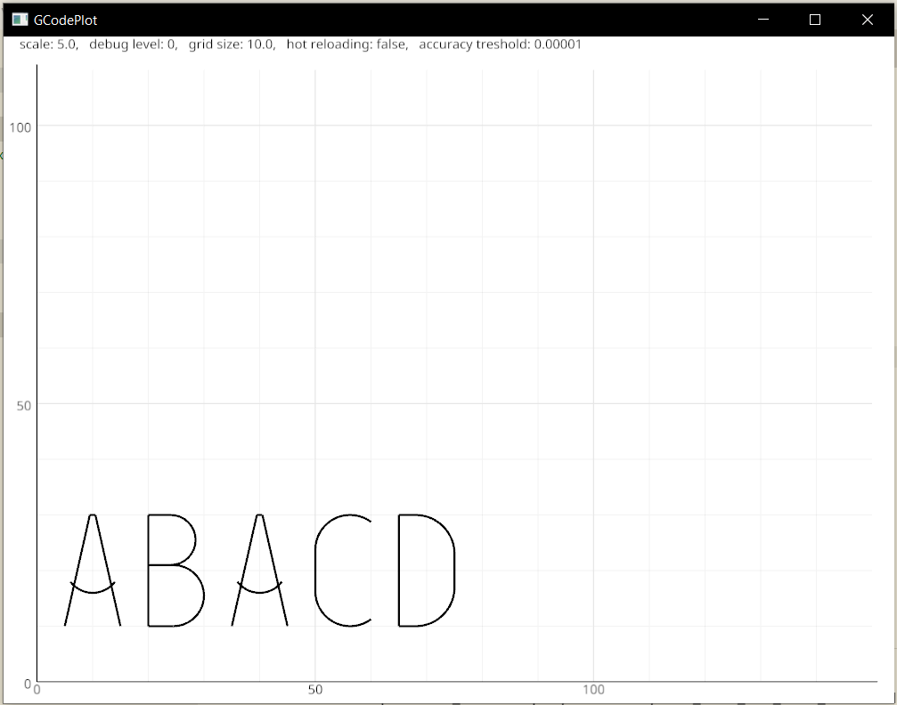
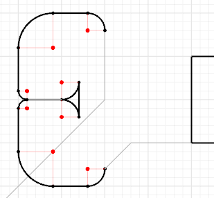

# gcodeplot

*Note that this app purposely supports only a very minimal subset of g-code features, since it is primarily supposed for educational purposes.*

*The pictures show a screenshot without debugging features and a zoomed screenshot of debugging features.*

## Description

`gcodeplot` is a simulated plotter of [G-code](http://en.wikipedia.org/wiki/G-code) files. It supports only
- `G28`: **return to home** position
- `G0 X{} Y{}`: **move**, move to `(X,Y)` (from current position) (note that you probably want to use `G1` instead)
- `G1 X{} Y{}`: **linear move**, move directly to `(X,Y)` (from current position)
- `G2 X{} Y{} I{} J{}`: (part-)**circular move in clockwise direction**, move to `(X,Y)` (from current position) along a circle with center in `CURRENTPOS + (I,J)`
- `G3 X{} Y{} I{} J{}`: (part-)**circular move in anticlockwise direction**, move to `(X,Y)` (from current position) along a circle with center in `CURRENTPOS + (I,J)`
- `M280 P0 S{}`: **Set the pen** as follows, if `S>=40` down (which means it can draw) and else up
- `;{}`: **comment**, which can be put on seperate line or after a regular command

## Arguments and features

The application is programmed in rust with the [nannou library](https://nannou.cc/) for displaying and the [pest library](https://pest.rs/) for parsing. It supports the following command line arguments:
- `INPUT` (required): sets the gcode file to plot
- `-d {}`, `--debug {}`: This enables debugging and can take values up to 3. While running, this can be changed with the key <kbd>D</kbd>
- `-s {}`, `--scale {}`: This scales the whole view. While running you can access it with the <kbd>+</kbd>(might be <kbd>=</kbd> on your PC) and <kbd>-</kbd> keys
- `-g {}`, `--gridsize`: This describes the gridsize used. While running you can access it with the key <kbd>G</kbd>
- the flag `--hot`, for hot reloading of the gcode file. Alternatively you can update in the app with <kbd>R</kbd>
- and other arguments as `--treshold`, `--wwidth` and `-wheight`.

It furthermore supports a subcommand `transform`, which
allows you to transform a file by translation and dilation.

## Keyboard commands and editing features

In the graphical app, a few keyboard commands are enabled. To increase a value corresponding to a <kbd>key</kbd>, just press <kbd>key</kbd> and to decrease press <kbd>shift</kbd> + <kbd>key</kbd>. For bigger steps combine these combination with a further <kbd>ctrl</kbd>.

Furthermore, I introduced in Version 0.3.0 the ability to extend existing g-code files. Simply press
- <kbd>0</kbd> for `G0` mode
- <kbd>1</kbd> for `G1` mode
- <kbd>2</kbd> for `G2` mode
- <kbd>3</kbd> for `G3` mode
- <kbd>esc</kbd> to exit the modes

and choose the coordinate with a left mouse click. One also can now undo and redo these added commands with <kbd>Z</kbd> and <kbd>Y</kbd> and save these changes to a new file with <kbd>S</kbd>. <kbd>P</kbd> changes the penmode and <kbd>H</kbd> returns to to home.

Last but not least, right-clicking prints the mouse coordinates to console and <kbd>Q</kbd> quits the application.

## Room to improve

While the app can be used for many purposes, it is in a early development phase. Tests are missing and not everything is programmed the clever way. If you want to improve it feel welcome to contribute.

TODO:
- [ ] better loop management for hot reloading
- [ ] more file maniplulation features
- [ ] move in grid support
- [X] draw mode?
- [ ] more debug options, e.g. show coordinates
- [ ] autoscale the view, using for instance <kbd>A</kbd>.